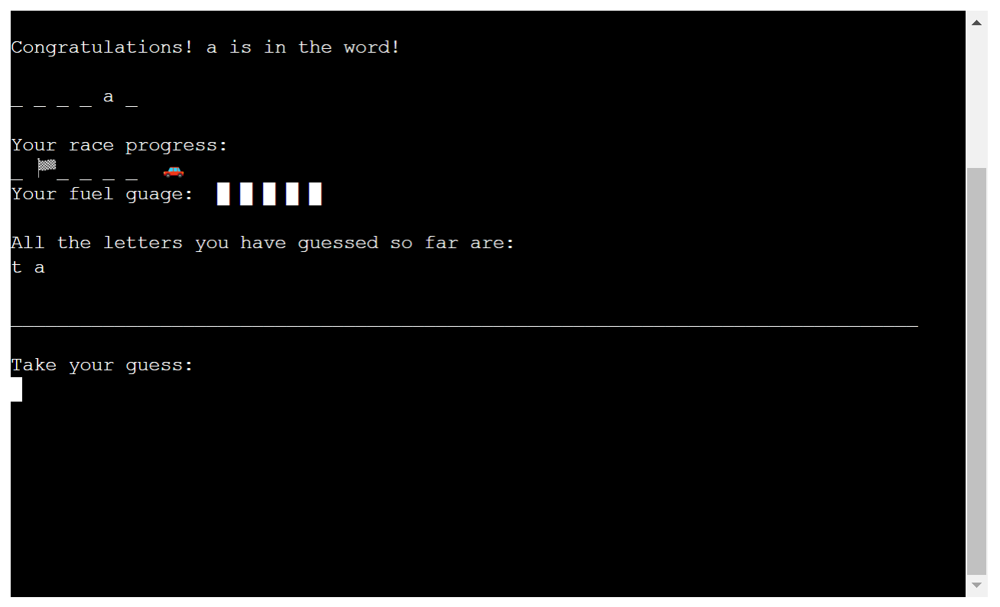
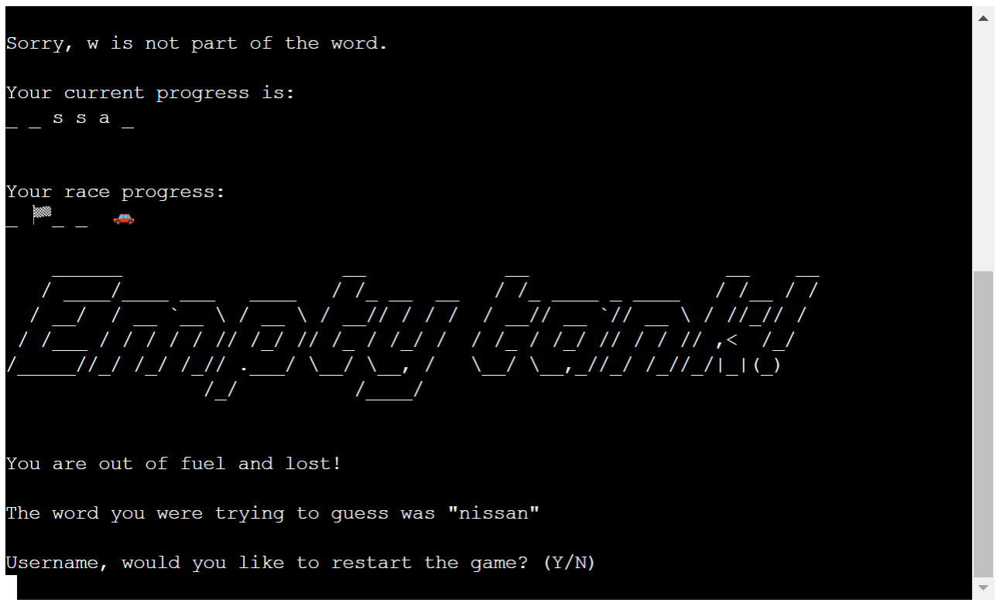
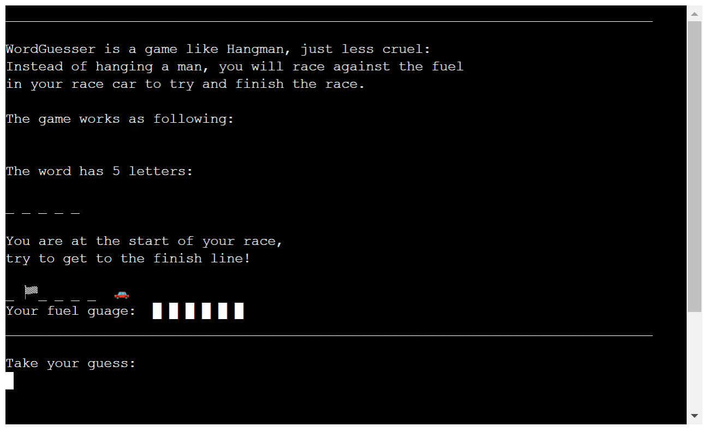

# WordGuesser
Word Guesser is a game that bases its core functionality on the well known game "Hangman" - but this version lets you race against the fuel in your racecar.

The game is a Python terminal game, which runs in the Code Institute mock terminal on Heroku in which you are trying to guess a car brand, which is randomly choosen with each try.

Click [here](https://wordguesserrace-cdad6feac143.herokuapp.com/) to get to the live version of [WordGuesser](https://wordguesserrace-cdad6feac143.herokuapp.com/).

## How to play

WordGuesser is based on the game hangman, more on which you can read about on [Wikipedia](https://en.wikipedia.org/wiki/Hangman_(game)).

First, the game asks you to put in a name, after which the user will be presented with the rules. To start the game, the user has to press the "enter" key and is then in a game loop, in which the game can be played as often as the user wants to.

As soon as the game starts, the amount of letters in the word will be displayed as well as underscores representing the missing letters. Additionally, the game will print a car, finish flag and a distance (underscores) between them.

Instead of just being punished for wrong inputs, the user will be rewarded for each correct guess by moving the race car closer to the finish line. The "punishment" for wrongly guessed letters is the loss of one bar of fuel. 

The words user has to guess are all known car brands, containing three up to 12 letters. To make the game easier, any letter is lower case and there are no whitespaces or dashes in the names. The user starts with 6 fuel bars (tries).

After the game is finished, either by winning or loosing, the user will be asked to replay or to end the game.

## Features

- The list of words contains 48 different car brands, which are chosen via the "random" module. This list was generated with ChatGPT and modified by me.

- For an easier game, Chinese and Russian car brands were excluded.

- The username input function requires a name containing any character and with a length between 1 and 23. After confirming the name the user will be greeted by the game.

- The validation will provide corresponding error messages for wrong name input, clears the terminal and ask for another input:

- The terminal will clear and provide the user with game rules, which are printed out with a time delay.

- The rules are too long for the single page, so the terminal will scroll (further info in the "bug" section).

- After confirming with the "enter" key, the terminal will clear and show the following message:

- This message will be cleared after 4 seconds, when the user will be shown the first "real" game page:

- After each guess, the terminal will be cleared and show the user weather the letter was correct or false, as well as every previously guessed letter, the race progress and the fuel guage.

- Almost every print statement has an artificial pause between 0.5 and 5 seconds added.

Wrong input
(only 5 fuel bars remain in this picture):

Correct input (the car gets a bit closer to the finish):

- Every input will be validated and only single letters that have not been guessed will be returned. If the user enters numbers, special symbols or multiple characters, the game will display a corresponding error message and ask again for a new input. 

- If the input was invalid, the terminal will not be cleared with the goal of allowing the user to scroll back up and see the current game progress (this has been added to unfixed bugs since it can be seen as such as well).

- If the game is won, the user will be shown that the car has crossed the finish line, with some ASCII art the user will be congratulated and asked if the game should end or restart:

- If the user loses, the previous progress, a different ASCII art as well as a message informing about the loss will be shown and the brand to guess is revealed:

- The restart question also has validation and only accepts "y" and "n", both in lower and upper case. Any other input will print a corresponding message and ask for another input:

- If the user selects a new game, it starts of with showing the game counter and the original start ASCII art:

- If the user decides to end the game, a "Thank you" ASCII art will be shown:

## Data Model

The game does not have any classes and relies just upon functions and one global variable. 

For better readability, I moved small functions, like "paused_print" (delayed print) and clearing the terminal into the "helper.py" file. 

The list of words as well as the global constant (game counter) are in the "words.py" file.

The function to print out different ASCII arts is in the file "art.py".

Besides the files and functions that I have created, the game also imports the following modules:

- os
- time
- random
- re

## Testing

I have manually tested the project:

- Any invalid input has a validation function with corresponding messages to the user
- Tested in GitPod and on the deployed Heroku app
- Using the [PEP8](https://pep8ci.herokuapp.com/) linter from Code Institute, no errors were shown.

### Bugs

Solved Bugs

- In the beginning, when I was creating the function that checks and prints, if the provided letter was part of the word, I was unable to get duplicate letters to show. As a solution I found that it was possible with the re (regular expressions) module.

- I was unable to increment the game counter until my mentor Akshat Garg provided me with the solution: Use a global variable.

- Not having limited the length of the lines to 79 characters gave me errors with linters. Using "Black Formatter" and setting the line length to 79, the files were structured better and the said problem was solved.

Unsolved Bugs

- The user is able to spam the terminal with invalid inputs without the terminal ever clearing.

- The game has pauses included, but will take any input at any given time - this results in the possibility of e.g. pressing the "enter" key twice after giving a username, which will result in immediate "continuing" without being able to finish reading the rules.

- Even if the "clear terminal" function is called at the end of the rules, in my last tryout, the top message was always displayed in case the user scrolls up. Without scrolling, the user does not get to see the message.

### Validator Testing

[PEP8](https://pep8ci.herokuapp.com/) from Code Institute:

## Deployment

This project was deployed using Code Institute's mock terminal for Heroku.

The steps for deployment are:

- Create a new Heroku app with a unique name and the region

- In the "settings" tab, set the buildpacks to 'Python' and 'NodeJS' (the order is important)
- Link the Heroku app to the GitHub repository

- In case it is wished, enable "automatic deploys" to automaticly update the app in case of a new commit

- Click on Deploy in the "manual deploy" area

## Credits

### Honorable mentions 
- I have to thank my dear partner for being so patient since there is not a lot of free time and yet she fully supports me on a daily basis.

- I am also thankful for my co-student Marceillo, Jan and Linus, who I worked closely together, and who helped me with questions, gave their input and in times of question.

- A big thank you goes out to the Tutors who have helped me along my third protfolio project: especially to John who assisted me with the understanding of my validation process.

### General reference: 
- Code Institute's LMS for the python project was very good, understanable and made the project a lot easier.

- A big help for my third project was my Mentor Akshat Garg who helped me with general information before I started and showed duplicate code that I was then able to convert into seperate functions.

- Harvards [CS50](https://www.youtube.com/watch?v=nLRL_NcnK-4&list=WL) course helped me a lot with understanding of the python language.

- I used some help from various [YouTube](https://www.youtube.com/) tutorials from [Kite](https://www.youtube.com/watch?v=m4nEnsavl6w&list=WL) and [Shaun Halversion](https://www.youtube.com/watch?v=pFvSb7cb_Us), [stackoverflow](https://stackoverflow.com/) posts and [w3schools](https://www.w3schools.com/) tutorials.

- For understanding some problems, as well as writing the list of words, I have also used [ChatGPT](https://chat.openai.com/) to get the explainations I nedded.

### Content

- For creating the responsiveness picture, I used [AmIResponsive](https://ui.dev/amiresponsive)

- For creating the ASCII art, I used [patorjk](https://patorjk.com/software/taag/#p=display&f=Slant&t=Type%20Something%20)

- For creating this readme, I took great inspriration from the readme provided in the "Project Portfolio Scope" lesson from the LMS. 
